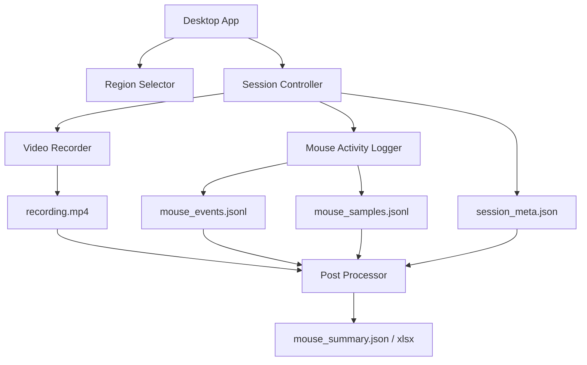

# Screen Mouse Recorder MVP PRD

## 1. 文档信息

| 项目 | 内容 |
| --- | --- |
| 产品名称 | Screen Mouse Recorder |
| 产品阶段 | MVP |
| 目标平台 | Windows 桌面 |
| 核心能力 | 区域录屏 + 鼠标活动记录 + 时间轴对齐 + 结构化导出 |
| 文档版本 | v0.2 |
| 更新日期 | 2026-07-01 |

## 2. 产品概述

Screen Mouse Recorder 是一个轻量级 Windows 桌面录制工具。用户可以在桌面上选择一个录制区域，开始后工具会同时录制该区域的视频，并记录整个桌面的鼠标活动。录制结束后，系统输出视频文件、鼠标活动日志、会话元数据和基础统计结果，方便后续进行回放、行为分析、点击频率统计、热区分析和时间线对齐。

该产品的核心价值不是替代专业录屏软件，而是补足普通录屏工具缺少的结构化交互数据。视频负责保留画面上下文，鼠标日志负责记录可计算、可统计、可关联的用户操作过程。

## 3. 背景与问题

普通录屏软件通常只能把鼠标轨迹或点击效果绘制在视频画面中，后续分析时只能通过人工观看判断点击位置、点击次数、点击间隔和拖拽行为。这会带来几个问题：

- 鼠标操作无法直接统计，需要反复回看视频。
- 点击位置只能肉眼估计，难以批量分析。
- 视频时间轴和操作时间轴没有独立结构化数据。
- 多段录制之间缺少统一的数据格式和会话信息。
- 后续如果要做自动化分析、热区图或行为摘要，需要重新从视频中识别鼠标轨迹，成本高且不稳定。

本 MVP 要解决的问题是：在录屏的同时，以结构化方式记录鼠标活动，并确保两者可以稳定对齐。

## 4. 产品目标

### 4.1 核心目标

1. 支持用户选择桌面区域并录制该区域视频。
2. 同步记录鼠标移动、点击、抬起、滚轮、拖拽等活动。
3. 将鼠标活动转换到录制区域坐标系中。
4. 使用可靠时间戳机制对齐视频和鼠标日志。
5. 输出可复用、可分析、可导入其他工具的数据文件。
6. 提供基础统计结果，例如点击次数、点击频率、区域内外点击、拖拽次数。

### 4.2 MVP 成功标准

- 用户可以在 1 分钟内完成区域选择并开始录制。
- 录制结束后自动生成一个完整 session 文件夹。
- `recording.mp4` 可以正常播放。
- `mouse_events.jsonl` 中能看到点击、移动采样、滚轮、拖拽等记录。
- 鼠标事件的 `t_video_ms` 与视频画面误差控制在可接受范围内，MVP 目标为 100ms 内。
- 输出文件可以被后续脚本读取，并转换成 xlsx 或分析图表。

## 5. 非目标

MVP 阶段暂不解决以下问题：

- 不做跨平台支持，优先只支持 Windows。
- 不做云端同步和团队账号系统。
- 不做复杂视频剪辑能力。
- 不做音频录制，除非后续明确需要。
- 不识别用户点击的具体 UI 语义，例如按钮名称、菜单名称。
- 不做键盘输入内容记录，避免隐私风险；后续如需要，只记录按键事件类型并默认关闭。
- 不做高级眼动、表情、摄像头采集。

## 6. 用户与使用场景

### 6.1 目标用户

- 需要记录桌面操作过程的研究人员。
- 需要分析软件使用过程的产品、设计、体验团队。
- 需要复盘用户行为路径的运营或数据分析人员。
- 需要保存操作证据和交互细节的测试人员。

### 6.2 典型场景

#### 场景 A：记录一次桌面软件操作

用户打开目标软件，启动 Screen Mouse Recorder，框选目标窗口区域，点击开始。结束后获得视频和鼠标活动日志，用于复盘用户完成任务的过程。

#### 场景 B：统计用户点击行为

用户完成一段录制后，系统自动生成点击次数、每分钟点击频率、点击热区、拖拽次数等数据。分析人员可以直接查看统计结果，而不需要手工数点击。

#### 场景 C：将操作日志与视频标注结合

分析人员在视频中标注关键事件时，可以根据鼠标事件日志快速定位高频操作、异常连点、长时间停留和拖拽行为。

#### 场景 D：批量录制多段样本

研究团队使用统一工具录制多段操作，每段录制都输出相同目录结构和数据 schema，方便后续统一处理。

## 7. MVP 功能范围

| 模块 | 功能 | MVP 是否包含 | 说明 |
| --- | --- | --- | --- |
| 区域选择 | 框选桌面录制区域 | 是 | 支持鼠标拖拽选择矩形区域 |
| 视频录制 | 录制选定区域为 MP4 | 是 | 优先使用 FFmpeg 或 OBS 控制 |
| 鼠标监听 | 记录移动、点击、滚轮 | 是 | 使用 Windows 全局鼠标监听 |
| 轨迹采样 | 定频记录鼠标坐标 | 是 | 默认 30Hz，可配置 |
| 点击识别 | 从 down/up 合成 click | 是 | 记录点击位置、间隔、按键 |
| 拖拽识别 | 从按下、移动、抬起合成 drag | 是 | 基于距离和持续时间阈值 |
| 时间同步 | 对齐视频和鼠标时间线 | 是 | 使用单调时钟和同步标记 |
| 数据导出 | 输出 JSONL、JSON、XLSX | 是 | MVP 至少输出 JSONL 和 meta JSON |
| 基础统计 | 点击频率、区域内外点击 | 是 | 输出 summary JSON，可选 xlsx |
| 回放界面 | 视频叠加鼠标轨迹回放 | 否 | 后续版本 |
| 热力图 | 点击热区图 | 可选 | MVP 后处理可先用脚本生成 |
| 云端管理 | 多人协作、上传云端 | 否 | 后续版本 |

## 8. 核心用户流程

### 8.1 单次录制流程

1. 用户启动工具。
2. 用户点击“选择区域”。
3. 屏幕进入区域选择模式。
4. 用户拖拽选择矩形区域。
5. 工具显示所选区域的位置和尺寸。
6. 用户点击“开始录制”。
7. 系统生成 `session_id`。
8. 系统启动鼠标监听。
9. 系统启动视频录制。
10. 系统写入同步标记。
11. 用户正常操作目标软件。
12. 用户点击“停止录制”。
13. 系统停止视频录制和鼠标监听。
14. 系统生成输出文件。
15. 系统展示输出目录和基础统计。

### 8.2 异常流程

| 异常 | 处理方式 |
| --- | --- |
| 录制区域为空或太小 | 禁止开始录制并提示重新选择 |
| FFmpeg/OBS 启动失败 | 提示错误，保留错误日志 |
| 鼠标监听启动失败 | 禁止开始录制，提示权限或系统问题 |
| 录制中目标窗口移动 | 继续录制原区域，并在 meta 中记录区域不随窗口移动 |
| 磁盘空间不足 | 停止录制并提示文件可能不完整 |
| 程序异常退出 | 尽可能保存已写入的鼠标日志和错误日志 |

## 9. 功能需求

### 9.1 区域选择

#### 需求描述

用户可以通过鼠标拖拽选择屏幕上的一个矩形区域。该区域作为视频录制范围，同时作为鼠标坐标转换的参考区域。

#### 具体要求

- 支持全屏半透明遮罩。
- 支持拖拽绘制矩形区域。
- 显示区域宽高和左上角坐标。
- 支持重新选择。
- 支持取消选择。
- 区域信息写入 `session_meta.json`。

#### 区域数据

```json
{
  "recording_region": {
    "screen_x": 1320,
    "screen_y": 180,
    "width": 540,
    "height": 1176
  }
}
```

### 9.2 视频录制

#### 需求描述

系统录制用户选定的桌面区域，并输出为 MP4 文件。

#### 具体要求

- 默认帧率：30 FPS。
- 默认格式：H.264 MP4。
- 默认录制区域：用户框选区域。
- 文件名固定为 `recording.mp4`。
- 录制开始和结束时间写入 meta。
- 支持配置输出目录。
- 录制中不强制显示鼠标轨迹，因为结构化鼠标日志会单独保存。

#### 实现候选

| 技术 | 优点 | 风险 |
| --- | --- | --- |
| FFmpeg gdigrab/ddagrab | 轻量、脚本化强、易集成 | 参数和兼容性需要封装 |
| OBS + WebSocket/启动参数 | 稳定、成熟、编码能力强 | 对用户环境依赖更重 |
| Windows Graphics Capture | 长期体验好、控制力强 | MVP 开发成本较高 |

#### MVP 建议

优先采用 FFmpeg 作为视频录制后端。原因是它便于被主程序控制，输出路径和区域参数明确，和鼠标监听进程更容易统一管理。

### 9.3 鼠标监听

#### 需求描述

系统监听 Windows 桌面的鼠标活动，记录操作事件和轨迹采样。

#### 记录范围

- 鼠标移动采样。
- 左键按下。
- 左键抬起。
- 右键按下。
- 右键抬起。
- 中键按下。
- 中键抬起。
- 滚轮。
- 点击事件。
- 双击候选。
- 拖拽开始。
- 拖拽移动。
- 拖拽结束。

#### 具体要求

- 鼠标监听覆盖整个桌面。
- 每条记录包含屏幕绝对坐标。
- 每条记录包含相对录制区域坐标。
- 每条记录包含是否位于录制区域内。
- 鼠标移动采样频率默认 30Hz。
- 鼠标事件使用系统 hook 记录，移动轨迹可使用定频采样补充。

#### 事件类型枚举

| event_type | 含义 |
| --- | --- |
| `move_sample` | 鼠标位置采样 |
| `left_down` | 左键按下 |
| `left_up` | 左键抬起 |
| `right_down` | 右键按下 |
| `right_up` | 右键抬起 |
| `middle_down` | 中键按下 |
| `middle_up` | 中键抬起 |
| `wheel` | 鼠标滚轮 |
| `click` | 单次点击 |
| `double_click_candidate` | 双击候选 |
| `drag_start` | 拖拽开始 |
| `drag_move` | 拖拽过程 |
| `drag_end` | 拖拽结束 |
| `sync_marker` | 同步标记 |

### 9.4 坐标转换

#### 需求描述

系统需要把全局屏幕坐标转换成录制区域内坐标，方便后续和视频画面对应。

#### 坐标字段

| 字段 | 说明 |
| --- | --- |
| `screen_x` | 鼠标在整个屏幕上的 X 坐标 |
| `screen_y` | 鼠标在整个屏幕上的 Y 坐标 |
| `region_x` | 鼠标相对录制区域左上角的 X 坐标 |
| `region_y` | 鼠标相对录制区域左上角的 Y 坐标 |
| `region_x_norm` | 录制区域内标准化 X 坐标，范围 0 到 1 |
| `region_y_norm` | 录制区域内标准化 Y 坐标，范围 0 到 1 |
| `inside_region` | 鼠标是否在录制区域内 |

#### 转换规则

```text
region_x = screen_x - recording_region.screen_x
region_y = screen_y - recording_region.screen_y
region_x_norm = region_x / recording_region.width
region_y_norm = region_y / recording_region.height
inside_region = region_x >= 0
             && region_y >= 0
             && region_x <= recording_region.width
             && region_y <= recording_region.height
```

### 9.5 时间戳与同步

#### 需求描述

系统必须确保视频和鼠标日志可以稳定对应。所有原始记录使用单调时钟，展示和分析时转换为视频时间。

#### 时间字段

| 字段 | 说明 |
| --- | --- |
| `wall_time` | 真实世界时间，用于查找和审计 |
| `t_monotonic_ms` | 单调时钟时间，原始对齐基准 |
| `t_video_ms` | 换算后的视频内时间 |
| `video_timecode` | 可读时间码，例如 `00:15.324` |

#### 同步原则

- 鼠标监听先启动。
- 视频录制随后启动。
- 记录视频启动请求时间。
- 记录视频零点估计时间。
- 录制开始时生成同步标记。
- 后处理时统一换算 `t_video_ms`。

#### 换算公式

```text
t_video_ms = t_monotonic_ms - video_zero_monotonic_ms
```

#### 同步标记

MVP 阶段建议在录制开始后短暂显示一个同步标记，例如窗口角落闪烁色块或文本标记。同步标记同时写入鼠标日志：

```json
{
  "event_type": "sync_marker",
  "marker_id": "SYNC_001",
  "t_monotonic_ms": 823.51,
  "t_video_ms": 133.01
}
```

### 9.6 输出文件

#### Session 目录结构

```text
sessions/
  20260609_153000/
    recording.mp4
    session_meta.json
    mouse_events.jsonl
    mouse_samples.jsonl
    mouse_summary.json
    mouse_summary.xlsx
    logs/
      app.log
      recorder.log
```

#### 文件说明

| 文件 | 必需 | 说明 |
| --- | --- | --- |
| `recording.mp4` | 是 | 录制区域视频 |
| `session_meta.json` | 是 | 会话元数据、区域、时间同步信息 |
| `mouse_events.jsonl` | 是 | 鼠标动作事件 |
| `mouse_samples.jsonl` | 是 | 鼠标移动轨迹采样 |
| `mouse_summary.json` | 是 | 自动统计摘要 |
| `mouse_summary.xlsx` | 可选 | 面向人工查看的统计表 |
| `logs/app.log` | 是 | 主程序日志 |
| `logs/recorder.log` | 是 | 录制模块日志 |

### 9.7 统计摘要

#### MVP 统计项

- 总录制时长。
- 总点击次数。
- 区域内点击次数。
- 区域外点击次数。
- 每分钟点击次数。
- 平均点击间隔。
- 最大连续点击频率。
- 拖拽次数。
- 滚轮次数。
- 鼠标在录制区域内的停留时长占比。
- 点击坐标分布。

#### 摘要示例

```json
{
  "duration_ms": 1800000,
  "click_total": 342,
  "click_inside_region": 331,
  "click_outside_region": 11,
  "clicks_per_minute": 11.4,
  "drag_count": 18,
  "wheel_count": 6,
  "inside_region_time_ratio": 0.94
}
```

## 10. 数据模型

### 10.1 session_meta.json

```json
{
  "schema_version": "1.0",
  "session_id": "20260609_153000",
  "app_version": "0.1.0",
  "platform": "windows",
  "created_at": "2026-06-09T15:30:00+08:00",
  "recording_region": {
    "screen_x": 1320,
    "screen_y": 180,
    "width": 540,
    "height": 1176
  },
  "video": {
    "file": "recording.mp4",
    "fps": 30,
    "width": 540,
    "height": 1176,
    "codec": "h264"
  },
  "timing": {
    "logger_start_monotonic_ms": 0,
    "video_start_request_monotonic_ms": 412.3,
    "video_zero_monotonic_ms": 690.5,
    "recording_stop_monotonic_ms": 1801123.2
  },
  "sync_markers": [
    {
      "marker_id": "SYNC_001",
      "t_monotonic_ms": 823.5,
      "expected_video_ms": 133.0
    }
  ]
}
```

### 10.2 mouse_events.jsonl

每行是一条鼠标事件：

```json
{
  "schema_version": "1.0",
  "session_id": "20260609_153000",
  "event_id": "evt_000001",
  "event_type": "click",
  "button": "left",
  "wall_time": "2026-06-09T15:30:15.324+08:00",
  "t_monotonic_ms": 15324.82,
  "t_video_ms": 14634.32,
  "video_timecode": "00:14.634",
  "screen_x": 1824,
  "screen_y": 914,
  "region_x": 504,
  "region_y": 734,
  "region_x_norm": 0.9333,
  "region_y_norm": 0.6241,
  "inside_region": true,
  "source": "mouse_hook"
}
```

### 10.3 mouse_samples.jsonl

每行是一条位置采样：

```json
{
  "schema_version": "1.0",
  "session_id": "20260609_153000",
  "sample_id": "smp_000001",
  "event_type": "move_sample",
  "wall_time": "2026-06-09T15:30:15.300+08:00",
  "t_monotonic_ms": 15300.00,
  "t_video_ms": 14609.50,
  "video_timecode": "00:14.609",
  "screen_x": 1810,
  "screen_y": 902,
  "region_x": 490,
  "region_y": 722,
  "region_x_norm": 0.9074,
  "region_y_norm": 0.6139,
  "inside_region": true,
  "source": "cursor_sampler"
}
```

### 10.4 SQLite 数据库设计

MVP 可以先使用文件输出，不强制内置数据库。但为了后续扩展，建议保留 SQLite 设计。

#### sessions

| 字段 | 类型 | 说明 |
| --- | --- | --- |
| `session_id` | TEXT PRIMARY KEY | 会话 ID |
| `created_at` | TEXT | 创建时间 |
| `app_version` | TEXT | 应用版本 |
| `platform` | TEXT | 平台 |
| `recording_region_x` | INTEGER | 录制区域左上角 X |
| `recording_region_y` | INTEGER | 录制区域左上角 Y |
| `recording_region_width` | INTEGER | 录制区域宽度 |
| `recording_region_height` | INTEGER | 录制区域高度 |
| `video_file` | TEXT | 视频文件路径 |
| `video_fps` | REAL | 视频帧率 |
| `video_zero_monotonic_ms` | REAL | 视频零点 |

#### mouse_events

| 字段 | 类型 | 说明 |
| --- | --- | --- |
| `event_id` | TEXT PRIMARY KEY | 事件 ID |
| `session_id` | TEXT | 会话 ID |
| `event_type` | TEXT | 事件类型 |
| `button` | TEXT | 鼠标按键 |
| `wall_time` | TEXT | 真实时间 |
| `t_monotonic_ms` | REAL | 单调时间 |
| `t_video_ms` | REAL | 视频时间 |
| `screen_x` | INTEGER | 屏幕 X |
| `screen_y` | INTEGER | 屏幕 Y |
| `region_x` | INTEGER | 区域 X |
| `region_y` | INTEGER | 区域 Y |
| `region_x_norm` | REAL | 标准化区域 X |
| `region_y_norm` | REAL | 标准化区域 Y |
| `inside_region` | INTEGER | 是否在区域内 |
| `source` | TEXT | 数据来源 |

#### mouse_samples

| 字段 | 类型 | 说明 |
| --- | --- | --- |
| `sample_id` | TEXT PRIMARY KEY | 采样 ID |
| `session_id` | TEXT | 会话 ID |
| `wall_time` | TEXT | 真实时间 |
| `t_monotonic_ms` | REAL | 单调时间 |
| `t_video_ms` | REAL | 视频时间 |
| `screen_x` | INTEGER | 屏幕 X |
| `screen_y` | INTEGER | 屏幕 Y |
| `region_x` | INTEGER | 区域 X |
| `region_y` | INTEGER | 区域 Y |
| `region_x_norm` | REAL | 标准化区域 X |
| `region_y_norm` | REAL | 标准化区域 Y |
| `inside_region` | INTEGER | 是否在区域内 |

#### session_summaries

| 字段 | 类型 | 说明 |
| --- | --- | --- |
| `session_id` | TEXT PRIMARY KEY | 会话 ID |
| `duration_ms` | REAL | 录制时长 |
| `click_total` | INTEGER | 总点击次数 |
| `click_inside_region` | INTEGER | 区域内点击次数 |
| `click_outside_region` | INTEGER | 区域外点击次数 |
| `clicks_per_minute` | REAL | 每分钟点击次数 |
| `drag_count` | INTEGER | 拖拽次数 |
| `wheel_count` | INTEGER | 滚轮次数 |
| `inside_region_time_ratio` | REAL | 区域内停留比例 |

## 11. 系统架构

### 11.1 MVP 架构



### 11.2 模块说明

| 模块 | 职责 |
| --- | --- |
| Desktop App | 主界面、开始/停止、状态展示 |
| Region Selector | 选择录制区域，生成区域坐标 |
| Session Controller | 创建 session、统一启动和停止各模块 |
| Video Recorder | 调用 FFmpeg/OBS 或原生 API 录屏 |
| Mouse Activity Logger | 监听鼠标事件和轨迹采样 |
| Time Sync Manager | 记录单调时间、视频零点、同步标记 |
| Storage Writer | 写入 JSONL、JSON、日志文件 |
| Post Processor | 生成统计摘要、转换时间戳、导出 xlsx |

## 12. 技术方案建议

### 12.1 MVP 技术栈候选

| 层级 | 建议 |
| --- | --- |
| 桌面界面 | Python + PySide6 / C# WPF / Electron |
| 视频录制 | FFmpeg |
| 鼠标监听 | Win32 `WH_MOUSE_LL` hook |
| 鼠标轨迹采样 | `GetCursorPos` 定频采样 |
| 数据输出 | JSONL + JSON + 可选 XLSX |
| 后处理 | Python |
| 打包 | PyInstaller / .NET single-file / Electron Builder |

### 12.2 推荐路线

MVP 推荐优先选择 Python + PySide6 + FFmpeg + Win32 hook。原因是开发速度快，便于快速验证数据格式和研究流程。若后续需要长期产品化，再迁移到 C# WPF 或原生 Windows Graphics Capture。

### 12.3 视频录制启动示例

```text
ffmpeg -f gdigrab -framerate 30 -offset_x {x} -offset_y {y} -video_size {w}x{h} -i desktop -c:v libx264 -preset veryfast recording.mp4
```

最终实现时需要由程序动态填充区域参数和输出路径。

## 13. 权限、隐私与安全

### 13.1 权限边界

- 工具会监听全桌面鼠标活动，但只记录鼠标事件和坐标。
- 默认不记录键盘输入。
- 默认不上传任何文件。
- 所有输出保存在本地。

### 13.2 隐私提示

开始录制前需要明确提示：

- 当前将录制选定屏幕区域。
- 当前将记录鼠标活动。
- 鼠标在录制区域外的活动也可能被记录为坐标事件。
- 用户应避免在录制过程中展示敏感信息。

### 13.3 数据脱敏

MVP 阶段不做自动脱敏，但应保留后续扩展能力：

- 隐藏区域外坐标。
- 只保留区域内鼠标活动。
- 删除原始视频，仅保留统计数据。
- 过滤指定时间段。

## 14. 配置项

| 配置项 | 默认值 | 说明 |
| --- | --- | --- |
| `video_fps` | 30 | 视频录制帧率 |
| `sample_fps` | 30 | 鼠标轨迹采样频率 |
| `output_root` | `sessions/` | 输出目录 |
| `record_outside_region` | true | 是否记录区域外鼠标活动 |
| `show_sync_marker` | true | 是否显示同步标记 |
| `click_max_duration_ms` | 500 | down/up 合成点击的最大间隔 |
| `click_max_distance_px` | 8 | down/up 合成点击的最大移动距离 |
| `drag_min_distance_px` | 10 | 判定拖拽的最小距离 |
| `double_click_window_ms` | 500 | 双击候选时间窗口 |

## 15. 质量要求

### 15.1 性能

- 鼠标监听不应明显影响系统操作。
- 轨迹采样默认 30Hz，CPU 占用应保持较低。
- JSONL 写入应采用缓冲或异步方式，避免阻塞 hook 回调。
- 视频录制应优先使用硬件或轻量编码配置。

### 15.2 稳定性

- 录制中断时应尽可能保留已生成数据。
- 每条 JSONL 记录应可独立解析。
- 写入文件时应定期 flush，降低崩溃损失。
- session 文件夹创建后不应覆盖已有 session。

### 15.3 时间精度

- 鼠标事件原始时间使用单调时钟。
- 轨迹采样误差目标小于一个采样周期。
- 视频和鼠标对齐误差 MVP 目标小于 100ms。
- 关键同步字段必须写入 meta 文件。

## 16. 测试计划

### 16.1 功能测试

| 测试项 | 预期 |
| --- | --- |
| 选择区域 | 能正确得到 x、y、width、height |
| 开始录制 | 生成 session 目录并开始写入文件 |
| 停止录制 | 视频和日志正常关闭 |
| 鼠标点击 | `mouse_events.jsonl` 出现 down/up/click |
| 鼠标移动 | `mouse_samples.jsonl` 持续写入采样 |
| 鼠标滚轮 | 记录 wheel 事件 |
| 拖拽 | 记录 drag_start/drag_move/drag_end |
| 区域内外 | `inside_region` 判断正确 |
| 坐标转换 | region 坐标和视频画面位置一致 |

### 16.2 时间同步测试

| 测试项 | 预期 |
| --- | --- |
| 同步标记 | 视频中可见，日志中可查 |
| 点击对齐 | 日志点击时间和视频中点击画面接近 |
| 长时录制 | 30 分钟录制后时间漂移可接受 |
| 暂停负载 | 高 CPU 情况下仍能保留主要事件 |

### 16.3 输出文件测试

| 测试项 | 预期 |
| --- | --- |
| MP4 播放 | 文件可正常播放 |
| JSONL 解析 | 每行都是合法 JSON |
| meta 完整 | 包含 session、区域、视频、时间字段 |
| summary 生成 | 能生成基础统计 |
| xlsx 打开 | 可用 Excel 打开 |

## 17. 验收标准

MVP 验收需要满足：

1. 可以选择桌面区域。
2. 可以开始和停止录制。
3. 可以输出完整 session 文件夹。
4. 视频文件可播放。
5. 鼠标活动日志包含点击、移动采样、滚轮、拖拽。
6. 鼠标坐标可以映射到录制区域。
7. 日志时间可以转换成视频时间。
8. 基础统计文件可以生成。
9. 连续录制 30 分钟不崩溃。
10. 输出数据 schema 稳定，便于后续分析接入。

## 18. 版本规划

### v0.1 MVP

- 区域选择。
- FFmpeg 区域录屏。
- 全局鼠标监听。
- 鼠标轨迹采样。
- JSONL/JSON 输出。
- 基础统计。
- 时间同步标记。

### v0.2 分析增强

- 输出 xlsx。
- 点击热区图。
- 视频帧截图 + 点击叠加图。
- 基础回放页面。
- Session 列表管理。

### v0.3 产品化

- 更友好的 UI。
- Windows Graphics Capture 原生录制。
- 多显示器增强。
- 配置预设。
- 批量导出。
- 可选键盘事件记录。

### v1.0 稳定版

- 安装包。
- 自动更新。
- 完整日志与错误报告。
- 数据脱敏工具。
- 插件式后处理。

## 19. 风险与应对

| 风险 | 影响 | 应对 |
| --- | --- | --- |
| 视频启动存在延迟 | 鼠标和视频错位 | 使用单调时钟和同步标记 |
| 高 DPI 缩放导致坐标不准 | 点击位置映射偏移 | 启动时检测 DPI，统一使用物理像素 |
| 多显示器坐标复杂 | 区域计算错误 | 明确记录虚拟桌面坐标系 |
| 鼠标 hook 被权限限制 | 无法记录事件 | 提示权限问题，提供管理员模式说明 |
| FFmpeg 环境缺失 | 无法录制视频 | 内置 FFmpeg 或首次启动检测 |
| 长时间录制文件过大 | 占用磁盘 | 显示剩余空间，支持质量配置 |
| JSONL 写入中断 | 数据损坏 | 每行独立 JSON，定期 flush |

## 20. 开放问题

1. MVP 是否需要录制系统声音或麦克风声音？
2. 是否需要默认隐藏区域外鼠标坐标？
3. 是否需要支持多显示器下跨屏选择区域？
4. 鼠标采样频率默认 30Hz 是否足够，是否需要 60Hz 选项？
5. 最终用户更适合使用 Python 打包工具、C# 桌面应用，还是 Electron 应用？
6. 是否需要把输出 xlsx 作为 MVP 必选项，而不是后处理可选项？

## 21. 推荐实施拆分

### 第一阶段：命令行验证

- 输入固定区域参数。
- 启动 FFmpeg 录制。
- 启动鼠标监听。
- 输出 JSONL 和 meta。
- 手工验证视频和日志对齐。

### 第二阶段：桌面 MVP

- 增加区域选择 UI。
- 增加开始/停止按钮。
- 增加输出目录展示。
- 增加基础统计。
- 增加错误提示。

### 第三阶段：分析增强

- 生成 xlsx。
- 生成点击热区图。
- 支持将鼠标轨迹叠加到视频截图。
- 支持按时间段筛选鼠标事件。

## 22. 后续功能：点击关键帧合成图

### 22.1 功能目标

点击关键帧合成图用于把现有合成图能力从“按时间抽帧”升级为“根据鼠标点击行为抽帧”。系统根据 `mouse_events.jsonl` 中的点击事件，从 `recording.mp4` 抽取更值得人工查看的画面，并通过保守去重过滤短时间、同位置、近似画面的重复操作，减少人工完整观看视频和判断关键画面的成本。

该功能的定位是“人工分析前的筛选层”，不替代原视频、不自动判断 UI 语义，也不强制输出结论。

### 22.2 用户价值

- 用户可以先扫一张图，快速了解关键点击发生在哪些画面。
- 高频重复点击、短时间连续点击、近似画面可被自动合并。
- 点击点、序号和时间戳直接叠加到画面上，便于复盘和标注。
- 输出图可以作为人工分析、报告附件和问题定位材料。

### 22.3 输入与输出

输入文件：

- `recording.mp4`
- `mouse_events.jsonl`
- `session_meta.json`

推荐输出文件：

- `click_keyframes.png`：默认点击关键帧合成图。
- `click_keyframes_001.png`、`click_keyframes_002.png`：关键帧过多时分页输出。
- `click_keyframes_index.json`：可选索引文件，记录每个小图对应的事件时间、点击坐标、事件类型和原始事件序号。

输出目录建议沿用当前 session 的分析输出目录，例如 `analysis_output/`。

### 22.4 事件筛选规则

第一版默认筛选：

- `click`

可选筛选：

- `double_click_candidate`
- `drag_start`
- `drag_end`

默认不包含拖拽事件，避免第一版合成图信息过杂。拖拽事件可作为增强参数开放。

### 22.5 抽帧与标记规则

- 根据事件的 `t_video_ms` 或同等视频时间字段定位视频帧。
- 抽帧时允许小范围时间偏移，例如点击时刻前后 `0ms ~ 150ms`，优先保证画面能看到点击后的反馈。
- 每张小图至少显示序号和时间戳。
- 启用点击点标记时，在录制区域坐标处绘制小圆点或圆环。
- 如果点击坐标缺失，则仍可抽帧，但不绘制点击点。

### 22.6 去重规则

第一版采用保守去重，避免误删重要操作。

默认规则：

- 时间去重：连续点击间隔小于 `500ms`，且位置接近时合并。
- 空间去重：连续点击距离小于 `20px`，认为可能属于同一操作区域。
- 画面去重：抽帧后生成低分辨率缩略图，画面差异很小时合并。
- 数量控制：默认最多保留 `60` 张关键帧；超过容量时优先分页输出，不直接丢弃。

保留原则：

- 时间间隔较大的点击保留。
- 点击位置明显不同的点击保留。
- 画面相似但点击位置不同的点击保留。
- 同一位置短时间重复点击才合并。

### 22.7 参数配置

建议提供以下参数：

| 参数 | 默认值 | 说明 |
| --- | --- | --- |
| 模式 | 点击关键帧 | 与均匀抽帧模式并存 |
| 最大帧数 | 60 | 单次输出默认保留数量 |
| 每行张数 | 5 | 合成图网格布局 |
| 时间去重 | 500ms | 短时间重复点击合并阈值 |
| 距离去重 | 20px | 同区域重复点击合并阈值 |
| 画面去重 | 开启 | 近似画面合并 |
| 显示点击点 | 开启 | 在帧图上标出点击位置 |
| 显示时间戳 | 开启 | 每张小图显示视频时间 |
| 包含拖拽事件 | 关闭 | 增强项，默认关闭 |

### 22.8 异常处理

- 缺少 `recording.mp4`：提示无法抽帧，不崩溃。
- 缺少 `mouse_events.jsonl`：提示缺少鼠标事件，可回退到均匀抽帧。
- 无点击事件：状态显示“无点击事件”，不算失败。
- 事件时间超出视频时长：跳过该事件并记录到日志或索引。
- FFmpeg 不可用：提示需要配置 FFmpeg。
- 抽帧失败：保留可成功生成的帧，并在状态中说明失败数量。

### 22.9 实施阶段

第一阶段：

- 点击事件抽帧。
- 时间/空间去重。
- 点击点、序号、时间戳标记。
- 单张 PNG 输出。

第二阶段：

- 画面相似去重。
- 多页 PNG 输出。
- `click_keyframes_index.json`。
- 拖拽事件支持。

第三阶段：

- 录制完成后自动生成基础点击关键帧图。
- 分析输出清单展示生成状态。
- 报告中引用关键帧图。

### 22.10 验收标准

- 正常录制结束后，可根据点击事件生成 `click_keyframes.png`。
- 合成图中的每个小图都来自真实点击附近的视频帧。
- 点击点能正确映射到视频画面坐标。
- 高频重复点击不会生成大量重复帧。
- 无点击、缺视频、缺鼠标日志时不会导致应用崩溃。
- 参数修改后可以重新生成。
- 生成过程不阻塞主 UI。
- 输出文件命名稳定，位于当前 session 的分析输出目录。

## 23. 一句话定义

Screen Mouse Recorder 是一个面向桌面行为分析的轻量录制工具：它同时保存“看到什么”的视频和“做了什么”的鼠标活动数据，并用统一时间轴把两者连接起来。
